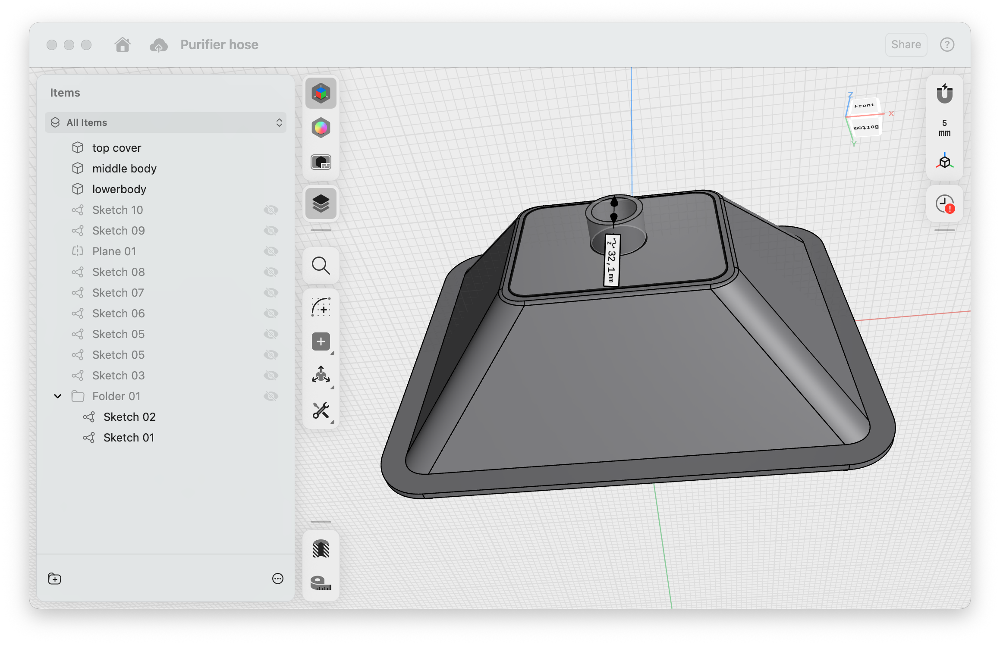

# UPPÅTVIND custom hose 3D files

This repo has the STL and 3MF 3D files for an Ikea UPPÅTVIND custom hose adapter.

Size has been adjusted to fit the Bambu Lab P1S maximum build volume.

You can either print the three parts top, middle and bottom without support and glue them (what I did), or print the full adapter in one shot, with support.

- Top [STL](top.stl), [3MF](top.3mf)

See https://celso.io/posts/2025/11/23/soldering-smoke-extractor/ for more details.
